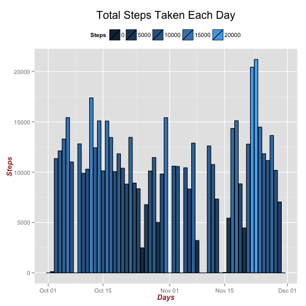
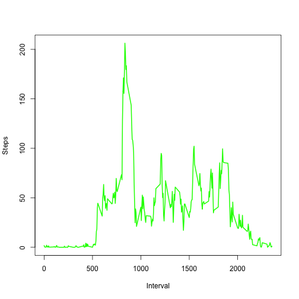
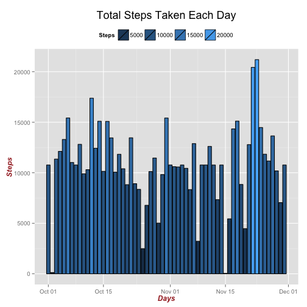

##Check if the data exists in the working directory

First things first ... We'll to see if the data file exists in a folder in the working directory called "data".  If the directory and data do not already exist, the directory will be created, the data file is downloaded, saved into the "data" directory and unzipped, placing a file called "activity.zip" into the "data" folder in the working directory.


```r
if (!file.exists("./data")) {
    dir.create("./data")
}

if (!file.exists("./data/repdata-data-activity.zip")) {
    fileUrl <- "https://d396qusza40orc.cloudfront.net/repdata%2Fdata%2Factivity.zip"
    download.file(fileUrl, destfile = "./data/repdata-data-activity.zip", method = "curl")
    dateDownloaded <- date()
    unzip("./data/repdata-data-activity.zip", exdir = "./data")
} else {
    dateDownloaded <- "**File already exists in working directory**"
}
```

File was downloaded on **File already exists in working directory**.

##Read the data

The data will be read into the variable "activty" and the summary provided as a check.


```r
activity <- read.csv ("./data/activity.csv")

summary(activity)
```

```
##      steps               date          interval   
##  Min.   :  0.0   2012-10-01:  288   Min.   :   0  
##  1st Qu.:  0.0   2012-10-02:  288   1st Qu.: 589  
##  Median :  0.0   2012-10-03:  288   Median :1178  
##  Mean   : 37.4   2012-10-04:  288   Mean   :1178  
##  3rd Qu.: 12.0   2012-10-05:  288   3rd Qu.:1766  
##  Max.   :806.0   2012-10-06:  288   Max.   :2355  
##  NA's   :2304    (Other)   :15840
```

##Question 1. What is mean total number of steps taken per day?

First, we must prepare the data to answer the question - here the data is aggregated and the total number of steps each day is summed.  Lastly, any NA data is omitted.  

```r
aggdata <-aggregate(x = activity$steps, by=list(activity$date), 
                    FUN=sum, na.rm=TRUE)

colnames(aggdata) <- c("date","steps")
aggdata$date <- as.Date(aggdata$date)
aggdata <- na.omit(aggdata)
```

###Part A. Make a histogram of the total number of steps taken each day
The ggplot2 package is used to prepare the histogram.

```r
library(ggplot2)
ggplot(data = aggdata, aes(x = date, y = steps, fill = steps)) + 
    geom_bar( width = .9,
              colour = "black", 
              stat = "identity",) +
    labs( x = "Days",
          y = "Steps",
          title = "Total Steps Taken Each Day") +
    theme(axis.title=element_text(face="bold.italic", 
                                  size="12", color="brown"), 
          legend.position="top",
          plot.title = element_text(size = "18")) +
    guides(fill=guide_legend(title="Steps"))
```

 

###Part B. Calculate and report the mean and median total number of steps taken per day
The mean and median steps are taken of the aggdata set.

```r
mean_per_day <- mean(aggdata$steps)
median_per_day <- median(aggdata$steps)
```

Mean total steps taken per day is **9354.2295.**  
Median total steps take per day is **10395.**

##Question 2. What is the average daily activity pattern?
###Part A. Make a time series plot (i.e. type = "l") of the 5-minute interval (x-axis) and the average number of steps taken, averaged across all days (y-axis)
The NA data is omitted and the data is aggregated to obtain the mean steps for each 5 minute interval.  The base graphics package is used to plot a line graph showing the mean steps taken for each 5 minute interval.

```r
omitted <- na.omit(activity)
aggdata_2 <-aggregate(x = omitted$steps, by=list(omitted$interval), FUN=mean)
colnames(aggdata_2) <- c("interval","steps")
plot(aggdata_2$interval, aggdata_2$steps, type="l", xlab= "Interval", ylab= "Steps", col="green" , lwd=2)
```

 

###Part B. Which 5-minute interval, on average across all the days in the dataset, contains the maximum number of steps?
Here, a subset of data equal to the max nuber of steps is taken - this returns only one row, containing the max steps.  

```r
max_steps <- subset(aggdata_2, aggdata_2$steps==max(aggdata_2$steps, na.rm = TRUE))
```

The **835** interval has the greatest number of mean steps per day, **206.1698.**

##Question 3. Imputing missing values

###Part A. Calculate and report the total number of missing values in the dataset (i.e. the total number of rows with NAs)
The sum of all NA data is taken.

```r
total_na <- sum(is.na(activity))
```

There are **2304** missing values in the dataset.

###Part B. Devise a strategy for filling in all of the missing values in the dataset. The strategy does not need to be sophisticated. For example, you could use the mean/median for that day, or the mean for that 5-minute interval, etc.

The mean of the 5 minute interval, as calculate above, will be used as a substitute for any missing data.

###Part C. Create a new dataset that is equal to the original dataset but with the missing data filled in.
First a new data set of all the incomplete cases is created.  The incomplete data set is used to loop through the aggdata_2 set - the set containing the mean for each 5 minute interval - to subset on a specific interval.  The row containing the mean steps for the 5 minute interval is then inserted into the incomplete set.

A new dataset is formed by row binding the omitted data and the data set where the mean steps were introduced.


```r
y <- activity[!complete.cases(activity),]
for(i in 1:nrow(y)){
    a <- subset(aggdata_2, aggdata_2$interval == y[i,"interval"])
    y[i,"steps"] <- a$steps  
}

new_activity <- rbind(omitted,y)
new_activity <- new_activity[ order(new_activity[,"date"]), ]  
head(new_activity)
```

```
##     steps       date interval
## 1 1.71698 2012-10-01        0
## 2 0.33962 2012-10-01        5
## 3 0.13208 2012-10-01       10
## 4 0.15094 2012-10-01       15
## 5 0.07547 2012-10-01       20
## 6 2.09434 2012-10-01       25
```

###Part D. Make a histogram of the total number of steps taken each day and Calculate and report the mean and median total number of steps taken per day. Do these values differ from the estimates from the first part of the assignment? What is the impact of imputing missing data on the estimates of the total daily number of steps?


```r
aggdata_3 <-aggregate(x = new_activity$steps, by=list(new_activity$date), 
                    FUN=sum, na.rm=TRUE)

colnames(aggdata_3) <- c("date","steps")
aggdata_3$date <- as.Date(aggdata_3$date)
aggdata_3 <- na.omit(aggdata_3)

library(ggplot2)
ggplot(data = aggdata_3, aes(x = date, y = steps, fill = steps)) + 
    geom_bar( width = .9,
              colour = "black", 
              stat = "identity",) +
    labs( x = "Days",
          y = "Steps",
          title = "Total Steps Taken Each Day") +
    theme(axis.title=element_text(face="bold.italic", 
                                  size="12", color="brown"), 
          legend.position="top",
          plot.title = element_text(size = "18")) +
    guides(fill=guide_legend(title="Steps"))
```

 


```r
options("scipen"=100, "digits"=4)
mean_per_day_3 <- mean(aggdata_3$steps)
median_per_day_3 <- median(aggdata_3$steps)
```

Mean total steps taken per day is **10766.1887.**  
Median total steps take per day is **10766.1887.**  
<sup>The mean and median were displaying in scientific notation for unknown reasons.  As can be seen in the code chunk, I had to change the options to have the data display in numeric form.<sup>

The values differ significantly from the original estimates.  Also, it should be noted that the mean and median have converged.  

##Question 4. Are there differences in activity patterns between weekdays and weekends?

###Part A. Create a new factor variable in the dataset with two levels – “weekday” and “weekend” indicating whether a given date is a weekday or weekend day.
A new factor variable is created, $day, to indicate whether the date is a weekday or a weekend.  First the date is used with the `weekdays()` function to determine the day of the week.  Then the day names are replaced with either weekday or weekend, creating a two-level factor variable.


```r
new_activity$date <- as.Date(new_activity$date)
new_activity$day <- as.factor(weekdays(new_activity$date))
levels(new_activity$day)[levels(new_activity$day) %in% c('Monday','Tuesday','Wednesday','Thursday','Friday')] <- "weekday"
levels(new_activity$day)[levels(new_activity$day) %in% c('Sunday','Saturday')] <- "weekend"
```

###Part B. Make a panel plot containing a time series plot (i.e. type = "l") of the 5-minute interval (x-axis) and the average number of steps taken, averaged across all weekday days or weekend days (y-axis).
The new data set containing the substituted mean steps is aggregated by the intervals and the mean steps are calculated (also, the $day is preserved for the graph).  

The Lattice graphics package is used to create a panel plot showing the difference in activity between the weekend and weekday.

```r
aggdata_4 <- aggregate(steps~interval+day,new_activity,mean)

library(lattice)
xyplot(steps ~ interval | day, aggdata_4, type="l", layout = c(1,2))
```

 
